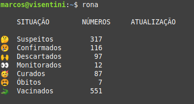

# rona :mask:

rona is a simple `alias` that runs a Python script I made to get data from my city hall official website about the COVID-19 pandemic. It'll work as long as the html structure of the website isn't changed.


## Getting Started

These instructions will get you a copy of the project up, but keep in mind that they were written assuming that you are on a Unix system.

### Prerequisites

- Download the `rona.py` and `.bash_aliases` files (available in this repository) and place them in the `Downloads` folder of your computer;

- Make sure you have `python3` and the `beautifulsoup4`, `requests` and `lxml` packages installed on your system.

### Setting Things Up

Create a directory called `rona` in your `home` directory. You can achieve this by opening your terminal and typing:

```bash
$ cd ~/
$ mkdir rona
```

Then, copy the `rona.py` file into the newly created directory (`rona`):

```bash
$ cp ~/Downloads/rona.py ~/rona/
```

 To make sure all went ok, enter the following commands:

```bash
$ cd ~/rona/
$ ls 
```

You should see as output the `rona.py` file you copied earlier.

```bash
rona.py
```

Now the next step is to create an `alias` to easily run our `rona.py` script in the terminal. To do so, copy the `.bash_aliases` file to your home directory. You can do this by typing:

```bash
$ cp ~/Downloads/.bash_aliases ~/
```

### Usage

Hooray! Now all that's left to do is to make sure everything is working properly. To do this, open your terminal and type `rona`. After a few seconds, you should see something like this as the output:



You can also get the same result by running only the `rona.py` file, typing:

```bash
$ cd ~/rona/
$ python3 rona.py 
```
